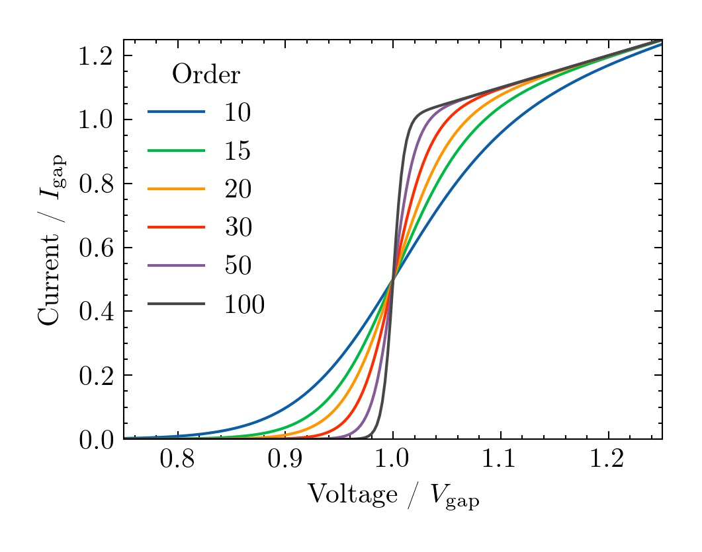

Thesis Plots
============

*Nicely formatted plots for a scientific thesis* 

**Author:** John Garrett (https://github.com/garrettj403)

**Description:** This repo has two matplotlib style files that you can use to format plots for your thesis (or academic paper).

**Use:** Put the ``*.mplstyle`` files in your ``mpl_configdir/stylelib`` directory. If you're not sure where ``mpl_configdir`` is located, in an interactive python console type:

```python
import matplotlib
matplotlib.get_configdir()
```

Then whenever you want to use one of these styles, simply add the following to the top of your python script:

```python
import matplotlib.pyplot as plt 
plt.style.use('thesis')
```

Example
-------

**Note:** This looks a lot better as a PDF!



See the ``examples/`` directory for more information.
